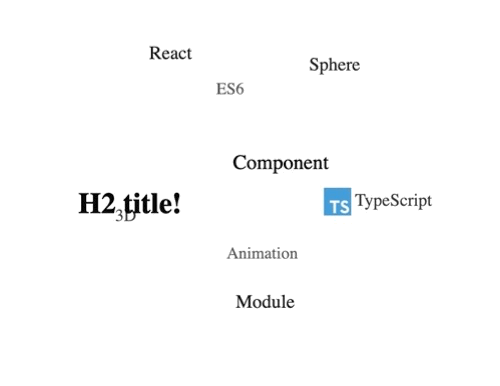

# Three D Cloud

<p align="center">
  
</p>

## Description

ThreeD Cloud is a React module using a 3D sphere to give a more interesting way to represent words, images or any other ReactNode element.

## Requirements

- [yarn](https://classic.yarnpkg.com/lang/en/docs/install/ 'yarn') : install dependencies using yarn
- [yalc](https://github.com/wclr/yalc 'yalc') : package development and simulating the publishing and installation of packages.

## Install

```shell
npm i @timsctt/threed-cloud
# or
yarn add @timsctt/threed-cloud
```

## Usage

After installed the package add these lines :

```typescript
import { CloudContainer } from '@timsctt/threed-cloud';

const MyComponent = () => {
  return (
    <>
      <CloudContainer radius={150} size={150} speed={1}>
        <p>Paragraph</p>
        <h4>Title</h4>
        <span>Basic element</span>
        
        {/* [...] */}
      </CloudContainer>
    </>
  );
};
```

### Building

Build package with tsup with production

```shell
yarn build
```

### Developing

First install dependencies by running

```shell
yarn
```

To render in storybook run

```shell
yarn dev
```

Watch and rebuild code with tsup and runs Storybook to preview your UI during development.

```shell
yalc add three-d-cloud
```

Link your package to your development project by simulating package manage by using `yalc`

```shell
yalc add three-d-cloud
# or
npx yalc link three-d-cloud
```

Run tests with `jest` when changes are detected

```shell
yarn test:watch
```

## API Reference

### CloudContainer

#### Props

| Props          | Type   | Default | Description                                                 |
| -------------- | ------ | ------- | ----------------------------------------------------------- |
| radius         | number | 200     | Determine cloud format. Used for depth calculation          |
| size           | number | 150     | Size of the square container : size = width = height        |
| speed          | number | 1       | Speed which cloud is animated                               |
| randomPosition | bool   | true    | Choose randomly a position for elements each time rendering |
| isPausable     | bool   | true    | Allows you to pause the movement                            |
| iconOnHover    | bool   | false   | Display on hover play/pause icon                            |
| mouseTracking  | bool   | true    | Track mouse position and change cloud movements based on it |
| className      | string | -       | Style classes spread by spaces                              |

## Contributing

Contributions are always welcome! See [CONTRIBUTING.md](https://github.com/Timsctt/ThreeD-Cloud/blob/master/CONTRIBUTING.MD 'CONTRIBUTING.md') for ways to get started.

## License

[MIT](https://choosealicense.com/licenses/mit/)

## Credit

- This project is strongly inspired from [TagCloud](https://github.com/cong-min/TagCloud 'TagCloud'). You will retrieve the main logic in TagCloud project but its written in JavaScript.
- The structure and tools is inspired from [tsup react package starter](https://github.com/TimMikeladze/tsup-react-package-starter 'tsup react package starter') which is a boilerplate for create, build & publish React packages with TypeScript on public repository.
